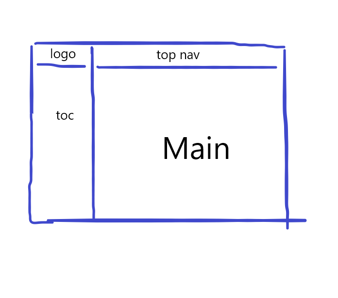
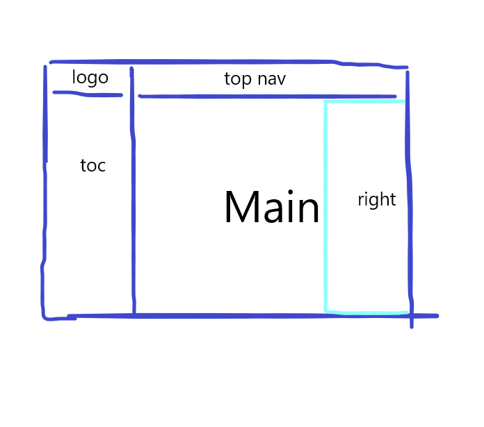

## Copilot 專案的開始
提問
```md
這是我的新專案的依賴版本
===
"dependencies": {
"@emotion/react": "^11.14.0",
"@emotion/styled": "^11.14.1",
"@mui/icons-material": "^7.3.1",
"@mui/material": "^7.3.1",
"react": "^19.1.1",
"react-dom": "^19.1.1",
"react-router-dom": "^7.8.0",
"zustand": "^5.0.7"
},
"devDependencies": {
"@eslint/js": "^9.33.0",
"@types/react": "^19.1.10",
"@types/react-dom": "^19.1.7",
"@vitejs/plugin-react": "^5.0.0",
"eslint": "^9.33.0",
"eslint-config-prettier": "^10.1.8",
"eslint-plugin-react": "^7.37.5",
"eslint-plugin-react-hooks": "^5.2.0",
"eslint-plugin-react-refresh": "^0.4.20",
"globals": "^16.3.0",
"prettier": "^3.6.2",
"typescript": "~5.8.3",
"typescript-eslint": "^8.39.1",
"vite": "^7.1.2"
}
===
我希望此專案用來管理資料表、自訂統計圖表、組裝儀表板，並提供上傳資料表格、統計圖表設定、儀表板設定，以及下載單獨統計圖表、儀表板、統計圖表設定、儀表板設定
```
回答
```md
感謝你提供這份依賴清單與專案目標！從你描述的功能來看，你的專案是一個資料視覺化與儀表板管理平台，具備以下核心功能：

- 資料表上傳與管理
- 統計圖表的自訂與設定
- 儀表板的組裝與設定
- 下載功能：圖表、儀表板與其設定

目前的依賴版本整體來說是現代且穩定的，以下是一些針對你的需求的建議與後續可考慮的套件或架構方向：

✅ 目前依賴的優點
- React 19 + Vite 7：非常現代的開發環境，效能佳。
- MUI + Emotion：適合快速建立美觀的 UI。
- Zustand：輕量的狀態管理，適合中小型應用。
- React Router v7：支援巢狀路由與懶加載，適合儀表板型應用。
- ESLint + Prettier + TypeScript：良好的開發體驗與型別安全。

🔧 建議補充的套件（依功能需求）
| 功能               | 建議套件                      | 說明                        |
| ------------------ | ----------------------------- | --------------------------- |
| 資料表上傳與解析   | papaparse                     | 處理 CSV/TSV 檔案上傳與解析 |
| 圖表繪製           | recharts 或 echarts-for-react | 建立互動式統計圖表          |
| 儀表板拖拉組裝     | react-grid-layout             | 支援拖拉式儀表板配置        |
| 設定儲存與匯出     | file-saver, jszip             | 匯出 JSON 設定或打包下載    |
| 表單設定 UI        | react-hook-form + zod         | 建立圖表與儀表板設定表單    |
| 多語系支援（如需） | react-i18next                 | 若未來考慮國際化            |

🧩 架構建議
你可以考慮將專案模組化為以下幾個區塊：

- 資料管理模組：上傳、解析、儲存資料表
- 圖表設定模組：選擇資料欄位、圖表類型、樣式設定
- 儀表板模組：拖拉式配置、儲存與載入儀表板
- 下載模組：匯出圖表圖片、設定 JSON、整體儀表板

如果你希望我幫你建立一個初始的專案結構或是設定某個功能模組（例如圖表設定或儀表板組裝），我可以一步步帶你完成。你想先從哪個部分開始呢？例如：

- 建立圖表設定 UI？
- 實作資料表上傳與解析？
- 儀表板拖拉式配置？
- 或是先建立整體的頁面路由架構？

你說了算！💡
```

## Copilot 提問 下次提問建議
```md
先暫停一下進度。
如果我下次要向AI(例如 你)提問，但他一無所知，我應該要給出怎樣的 prompt 作為開頭提示，會有更好的效果。
如果可以請套用專業的 prompt 框架
```

## Copilot 回答 下次提問建議

這是一個非常棒的問題！如果你希望在未來向 AI（像我）提問時，即使我們對某個主題「一無所知」，也能幫你產出更準確、更有價值的回應，那麼你可以使用一個專業的 Prompt 框架來引導我們理解你的意圖與背景。

### 🎯 專業 Prompt 框架：RICCE
這是一個我推薦的框架，適合技術、產品、設計、研究等領域的提問：

| 項目                | 說明                                                                                         |
| ------------------- | -------------------------------------------------------------------------------------------- |
| Role（角色）        | 指定 AI 扮演的角色，例如「你是一位資深前端工程師」                                           |
| Intent（意圖）      | 說明你希望達成的目標，例如「我想建立一個可視化儀表板」                                       |
| Context（背景）     | 提供目前的狀況、已有的資料、限制條件等                                                       |
| Constraints（限制） | 指定技術限制、時間、框架、語言等                                                             |
| Expectation（期望） | 說明你希望 AI 回覆的形式，例如「請用 TypeScript + React 實作範例」或「請列出三種解法並比較」 |

### 🧠 範例 Prompt（以你目前的專案為例）
你是一位資深 React 工程師。我正在開發一個資料視覺化儀表板，使用 Vite + React + MUI + Zustand。目前我已完成基本 UI 架構，接下來想實作圖表設定功能。請根據我提供的資料結構，幫我設計一個可動態設定圖表類型、資料來源與樣式的元件，並用 TypeScript 撰寫。請提供元件架構、狀態管理方式與 UI 實作建議。

### 🧩 提問時的提示語句（你可以套用）
- 「你是一位熟悉 ___ 技術的工程師，請根據以下背景協助我解決問題。」
- 「我希望達成 ___，目前的狀況是 ___，請根據這些條件提供建議或範例。」
- 「請用 ___ 技術實作，並考慮以下限制：___。」
- 「請列出 ___ 的三種作法，並比較優缺點。」

如果你想，我可以幫你建立一個可重複使用的 Prompt 模板，讓你未來只要填空就能快速提問。你想要這樣的模板嗎？還是想針對某個領域（例如 React、資料視覺化、AI 工具整合）建立專屬提問格式？


## Copilot 提問 專案架構
```
你是一位資深 React 工程師。我正在開發一個資料視覺化儀表板，使用 Vite + React + MUI + Zustand。此專案包含以下模組:

- 資料管理模組：上傳、解析、儲存資料表
- 圖表設定模組：選擇資料表、資料欄位、圖表類型、樣式設定
- 儀表板模組：拖拉式配置、儲存與載入儀表板
- 下載模組：匯出圖表圖片、設定 JSON、整體儀表板

對於此專案你有什麼架構建議。
```

## Copilot 回答 專案架構
這是一個非常有潛力的資料視覺化儀表板專案，使用 Vite + React + MUI + Zustand 是個現代且高效的技術組合。以下是我針對你列出的模組，提出的架構建議與最佳實踐：

---

### 🔧 整體架構建議

1. **模組化設計**
   - 每個模組（資料管理、圖表設定、儀表板、下載）應獨立成為一個資料夾，包含：
     - `components/`：模組內的 UI 元件
     - `store.ts`：Zustand 狀態管理
     - `services.ts`：API 或資料處理邏輯
     - `types.ts`：型別定義
     - `utils.ts`：輔助函式

2. **路由規劃（如有多頁）**
   - 使用 `react-router-dom`，將每個模組對應到一個 route，例如：
     ```tsx
     <Route path="/upload" element={<UploadPage />} />
     <Route path="/chart-config" element={<ChartConfigPage />} />
     <Route path="/dashboard" element={<DashboardPage />} />
     ```

3. **狀態管理（Zustand）**
   - 建議使用 `zustand` 的 `persist` middleware 儲存使用者設定與儀表板配置。
   - 將全域狀態（如目前選擇的資料表、圖表設定）集中管理，避免 prop drilling。

4. **UI 框架（MUI）**
   - 使用 MUI 的 `Grid`, `Box`, `Dialog`, `Drawer` 等元件來實現拖拉式配置與彈窗設定。
   - 建議使用 `ThemeProvider` 統一樣式主題。

---

### 📦 各模組建議

#### 1. 資料管理模組
- 支援 CSV / Excel 上傳與解析（可用 `papaparse` 或 `xlsx` 套件）
- 將解析後的資料儲存至 Zustand store
- 提供資料預覽表格（使用 MUI 的 `DataGrid`）

#### 2. 圖表設定模組
- 提供欄位選擇器（下拉選單）
- 圖表類型選擇（Bar, Line, Pie 等）
- 樣式設定（顏色、標題、軸線等）
- 可考慮使用 `react-chartjs-2` 或 `echarts-for-react`

#### 3. 儀表板模組
- 拖拉式配置建議使用 `react-grid-layout` 或 `dnd-kit`
- 儲存配置至 localStorage 或後端 API
- 載入時重建圖表元件

#### 4. 下載模組
- 匯出圖片：使用 `html2canvas` 或 `dom-to-image`
- 匯出 JSON：儲存目前設定與資料
- 儀表板整體匯出：可打包成 zip（使用 `jszip`）

---

### ✅ 額外建議

- 使用 TypeScript 強化型別安全
- 加入錯誤處理與 loading 狀態（例如 `useSnackbar` 顯示錯誤）
- 善用 lazy loading 與 code splitting 提升效能
- 若有多人使用需求，可考慮加入登入與雲端儲存功能

---

如果你有想看的範例程式碼、某個模組的具體實作問題，或想討論資料結構設計，我可以進一步協助！你目前最想先處理哪一部分呢？


## Copilot 提問 頁面結構規劃
```
我將架構改成了

- `components/`：模組內的 UI 元件
- `stores/`：Zustand 狀態管理
- `services/`：API 或資料處理邏輯
- `types.ts`：型別定義
- `utils.ts`：輔助函式

並且使用 TypeScript。

我們能先從頁面結構規劃先開始嗎

- 左側側邊欄
   - 上方為本平台logo圖示
   - 下方為目錄區塊 toc: 根據不同模組會顯示不同目錄條目
- 右側
   - 上方導覽列 top nav
      - 左側: 顯示當前頁面路徑
      - 右側: 搜尋按鈕
   - 主內容區塊 main: 根據不同模組會顯示不同內容
   - 右側側邊欄 right: 平時不顯示，當滑鼠滑至右側會顯示並覆蓋主內容區塊。根據不同模組會顯示不同內容，部分模組不需要此區塊

```




## Copilot 回答 頁面結構規劃

非常好！你已經有清楚的架構規劃，現在我們來設計整體頁面結構，讓各模組能夠在統一的框架下運作。以下是根據你描述的需求，建議的頁面結構與元件拆分方式：

---

### 🧭 頁面結構總覽

```
App
├── Layout
│   ├── Sidebar (左側側邊欄)
│   ├── TopNav (上方導覽列)
│   ├── MainContent (主內容區塊)
│   └── RightPanel (右側側邊欄)
└── Router (根據模組切換內容)
```

---

### 📁 建議元件與資料夾結構

```bash
src/
├── components/
│   ├── layout/
│   │   ├── Sidebar.tsx
│   │   ├── TopNav.tsx
│   │   ├── RightPanel.tsx
│   │   └── Layout.tsx
│   └── ...
├── pages/
│   ├── UploadPage.tsx
│   ├── ChartConfigPage.tsx
│   ├── DashboardPage.tsx
│   └── DownloadPage.tsx
├── stores/
│   └── uiStore.ts
├── types.ts
├── utils.ts
└── App.tsx
```

---

### 🧱 Layout.tsx 範例

```tsx
// components/layout/Layout.tsx
import { Sidebar } from './Sidebar';
import { TopNav } from './TopNav';
import { RightPanel } from './RightPanel';
import { Outlet } from 'react-router-dom';
import './layout.css';

export const Layout = () => {
  return (
    <div className="layout-container">
      <Sidebar />
      <div className="main-area">
        <TopNav />
        <div className="main-content">
          <Outlet />
        </div>
      </div>
      <RightPanel />
    </div>
  );
};
```

---

### 🎨 CSS 結構建議（layout.css）

```css
.layout-container {
  display: flex;
  height: 100vh;
  overflow: hidden;
}

.sidebar {
  width: 240px;
  background-color: #1e1e2f;
}

.main-area {
  flex: 1;
  display: flex;
  flex-direction: column;
}

.top-nav {
  height: 60px;
  background-color: #fff;
  border-bottom: 1px solid #ddd;
}

.main-content {
  flex: 1;
  overflow-y: auto;
  padding: 16px;
}

.right-panel {
  position: fixed;
  right: 0;
  top: 60px;
  width: 300px;
  height: calc(100vh - 60px);
  background-color: #f9f9f9;
  box-shadow: -2px 0 5px rgba(0,0,0,0.1);
  transform: translateX(100%);
  transition: transform 0.3s ease;
}

.right-panel.visible {
  transform: translateX(0);
}
```

---

### 🧠 狀態管理（右側面板顯示）

```ts
// stores/uiStore.ts
import { create } from 'zustand';

interface UIState {
  rightPanelVisible: boolean;
  toggleRightPanel: (visible: boolean) => void;
}

export const useUIStore = create<UIState>((set) => ({
  rightPanelVisible: false,
  toggleRightPanel: (visible) => set({ rightPanelVisible: visible }),
}));
```

---

### 🧩 模組整合方式

- `Sidebar` 根據目前路由顯示不同目錄（可用 `useLocation()` 判斷）
- `RightPanel` 根據模組決定是否顯示（可用 Zustand 控制）
- `TopNav` 顯示路徑與搜尋按鈕（可用 `useLocation()` + `Breadcrumb`）

---

如果你希望我幫你建立某個元件的具體程式碼（例如 Sidebar 或 TopNav），或是整合路由與 Layout，我可以一步步協助你完成。你想先從哪個元件開始？

推薦三問: `先做 Sidebar 元件範例`、`TopNav 怎麼實作 breadcrumb 路徑`、`RightPanel 滑入效果怎麼寫`

## Copilot 回答 先做 Sidebar 元件範例

好的！以下是一個簡單的 `Sidebar` 元件範例，符合你描述的需求：左側側邊欄，上方為 logo，下方為根據模組顯示的目錄區塊（TOC）。

---

### 📁 檔案位置建議
```
src/components/layout/Sidebar.tsx
```

---

### 🧩 Sidebar 元件程式碼

```tsx
// components/layout/Sidebar.tsx
import React from 'react';
import { useLocation } from 'react-router-dom';
import { Box, List, ListItemButton, ListItemText, Typography } from '@mui/material';

const tocMap: Record<string, string[]> = {
  '/upload': ['上傳資料', '資料預覽'],
  '/chart-config': ['選擇資料表', '設定圖表'],
  '/dashboard': ['儀表板配置', '圖表管理'],
  '/download': ['匯出圖片', '匯出設定'],
};

export const Sidebar: React.FC = () => {
  const location = useLocation();
  const currentPath = location.pathname;
  const tocItems = tocMap[currentPath] || [];

  return (
    <Box
      sx={{
        width: 240,
        height: '100vh',
        bgcolor: '#1e1e2f',
        color: '#fff',
        display: 'flex',
        flexDirection: 'column',
        p: 2,
      }}
    >
      {/* Logo 區塊 */}
      <Box sx={{ mb: 4 }}>
        <Typography variant="h6" fontWeight="bold">
          📊 MyDashboard
        </Typography>
      </Box>

      {/* TOC 區塊 */}
      <List>
        {tocItems.map((item, index) => (
          <ListItemButton key={index} sx={{ color: '#fff' }}>
            <ListItemText primary={item} />
          </ListItemButton>
        ))}
      </List>
    </Box>
  );
};
```

---

### ✅ 補充說明

- `useLocation()` 用來取得目前路由，根據路徑顯示對應的 TOC。
- `tocMap` 是一個簡單的路徑對應表，你可以根據模組擴充或改成動態載入。
- 使用 MUI 的 `Box`, `List`, `Typography` 等元件來快速建立樣式。

---

接下來你想做哪個元件？要不要一起做 `TopNav` 或是整合 `Layout.tsx`？我可以幫你一步步完成。

## Copilot 提問 Route 錯誤
```
react-router-dom.js?v=5e0d3958:525 Uncaught Error: useLocation() may be used only in the context of a <Router> component.
    at invariant (react-router-dom.js?v=5e0d3958:525:11)
    at useLocation (react-router-dom.js?v=5e0d3958:5347:3)
    at Sidebar (Sidebar.tsx:20:20)
```

## Copilot 回答 Route 錯誤

這個錯誤訊息表示你在使用 `useLocation()` 時，元件並不在 `<Router>` 的上下文中。這是 React Router 的基本要求：**所有使用路由相關 hook 的元件都必須包在 `<BrowserRouter>` 或 `<HashRouter>` 裡面**。

---

### ✅ 解法：確認你的 `App.tsx` 有包住 Router

請檢查你的 `App.tsx` 是否有像這樣的結構：

```tsx
// App.tsx
import { BrowserRouter, Routes, Route } from 'react-router-dom';
import { Layout } from './components/layout/Layout';
import { UploadPage } from './pages/UploadPage';
import { ChartConfigPage } from './pages/ChartConfigPage';
import { DashboardPage } from './pages/DashboardPage';
import { DownloadPage } from './pages/DownloadPage';

function App() {
  return (
    <BrowserRouter>
      <Routes>
        <Route path="/" element={<Layout />}>
          <Route path="upload" element={<UploadPage />} />
          <Route path="chart-config" element={<ChartConfigPage />} />
          <Route path="dashboard" element={<DashboardPage />} />
          <Route path="download" element={<DownloadPage />} />
        </Route>
      </Routes>
    </BrowserRouter>
  );
}

export default App;
```

---

### 🔍 為什麼會出錯？

如果你直接在 `Sidebar.tsx` 中使用 `useLocation()`，但沒有把整個應用包在 `<BrowserRouter>` 裡，就會出現這個錯誤。

---

### 🧪 快速測試方式

你可以在 `Sidebar.tsx` 中加上這段防呆：

```tsx
import { useLocation } from 'react-router-dom';

let location;
try {
  location = useLocation();
} catch (e) {
  console.error('Sidebar 必須在 <Router> 中使用');
}
```

但這只是暫時避免錯誤，**根本解法還是要確認你的應用有包住 `<BrowserRouter>`**。

---

如果你已經有包住 `<BrowserRouter>`，但還是出錯，可以貼出你的 `App.tsx` 結構，我幫你一起檢查！是否要我幫你建立一個完整的 `App.tsx` 範例？


## Copilot 提問 TopNav 元件
```
App.tsx 已修正成功。接下來我們討論 TopNav 元件，我希望有以下結構與功能

- breadcrumb 路徑: 顯示當前頁面路徑，用 `>` 分階層，每一階層都可以點擊跳轉。如果路徑超過3階層，只顯示最小的兩階層，其他用 `...` 收合。滑鼠懸停於 `...` 時，會以下拉選單顯示收合階層，各階層都可以點擊跳轉。
- 搜尋按鈕: 點按後以 Full screen Overlay Navigation 的方式浮出 Search Bar，具體搜尋功能暫時不實作。
```

## Copilot 提問 TopNav 元件

非常棒的設計構想！我們來一步步建立 `TopNav` 元件，包含：

1. **Breadcrumb 路徑顯示與跳轉**
2. **超過三階層時的收合與下拉選單**
3. **搜尋按鈕與全螢幕浮出搜尋介面**

---

### 📁 檔案位置建議

```
src/components/layout/TopNav.tsx
```

---

### 🧩 TopNav 元件實作（含 Breadcrumb 與搜尋按鈕）

```tsx
// components/layout/TopNav.tsx
import React, { useState } from 'react';
import {
  Box,
  Typography,
  IconButton,
  Menu,
  MenuItem,
  Modal,
  TextField,
} from '@mui/material';
import SearchIcon from '@mui/icons-material/Search';
import { useNavigate, useLocation } from 'react-router-dom';

export const TopNav: React.FC = () => {
  const location = useLocation();
  const navigate = useNavigate();
  const [anchorEl, setAnchorEl] = useState<null | HTMLElement>(null);
  const [searchOpen, setSearchOpen] = useState(false);

  const pathSegments = location.pathname.split('/').filter(Boolean);

  const handleBreadcrumbClick = (index: number) => {
    const path = '/' + pathSegments.slice(0, index + 1).join('/');
    navigate(path);
  };

  const handleMoreClick = (event: React.MouseEvent<HTMLElement>) => {
    setAnchorEl(event.currentTarget);
  };

  const handleMoreClose = () => {
    setAnchorEl(null);
  };

  const handleSearchOpen = () => setSearchOpen(true);
  const handleSearchClose = () => setSearchOpen(false);

  return (
    <Box
      sx={{
        height: 60,
        px: 2,
        display: 'flex',
        alignItems: 'center',
        justifyContent: 'space-between',
        borderBottom: '1px solid #ddd',
        bgcolor: '#fff',
      }}
    >
      {/* Breadcrumb 區塊 */}
      <Box sx={{ display: 'flex', alignItems: 'center', gap: 1 }}>
        {pathSegments.length > 3 ? (
          <>
            <Typography
              sx={{ cursor: 'pointer' }}
              onClick={() => handleBreadcrumbClick(0)}
            >
              {pathSegments[0]}
            </Typography>
            <Typography>{'>'}</Typography>
            <Typography
              sx={{ cursor: 'pointer' }}
              onClick={() => handleBreadcrumbClick(pathSegments.length - 2)}
            >
              {pathSegments[pathSegments.length - 2]}
            </Typography>
            <Typography>{'>'}</Typography>
            <Typography
              sx={{ cursor: 'pointer', fontWeight: 'bold' }}
              onClick={() => handleBreadcrumbClick(pathSegments.length - 1)}
            >
              {pathSegments[pathSegments.length - 1]}
            </Typography>
            <IconButton size="small" onClick={handleMoreClick}>
              <Typography fontSize={12}>...</Typography>
            </IconButton>
            <Menu anchorEl={anchorEl} open={Boolean(anchorEl)} onClose={handleMoreClose}>
              {pathSegments.slice(1, pathSegments.length - 2).map((seg, i) => (
                <MenuItem
                  key={i}
                  onClick={() => {
                    handleBreadcrumbClick(i + 1);
                    handleMoreClose();
                  }}
                >
                  {seg}
                </MenuItem>
              ))}
            </Menu>
          </>
        ) : (
          pathSegments.map((seg, i) => (
            <React.Fragment key={i}>
              {i > 0 && <Typography>{'>'}</Typography>}
              <Typography
                sx={{ cursor: 'pointer', fontWeight: i === pathSegments.length - 1 ? 'bold' : 'normal' }}
                onClick={() => handleBreadcrumbClick(i)}
              >
                {seg}
              </Typography>
            </React.Fragment>
          ))
        )}
      </Box>

      {/* 搜尋按鈕 */}
      <IconButton onClick={handleSearchOpen}>
        <SearchIcon />
      </IconButton>

      {/* 全螢幕搜尋浮層 */}
      <Modal open={searchOpen} onClose={handleSearchClose}>
        <Box
          sx={{
            position: 'fixed',
            top: 0,
            left: 0,
            width: '100vw',
            height: '100vh',
            bgcolor: 'rgba(0,0,0,0.8)',
            display: 'flex',
            alignItems: 'center',
            justifyContent: 'center',
            zIndex: 1300,
          }}
        >
          <TextField
            autoFocus
            placeholder="請輸入搜尋內容..."
            variant="outlined"
            sx={{ width: '60%', bgcolor: '#fff', borderRadius: 1 }}
          />
        </Box>
      </Modal>
    </Box>
  );
};
```

---

### ✅ 補充說明

- `useLocation()` 取得目前路徑，並拆分為階層。
- 超過三階層時，顯示第一層與最後兩層，中間用 `...` 收合。
- `Menu` 元件用於懸停展開收合階層。
- `Modal` 實現全螢幕搜尋浮層，未來可擴充搜尋功能。

---

是否需要我幫你整合到 `Layout.tsx` 中，或是幫你做 `RightPanel` 元件？也可以一起設計搜尋功能的狀態管理與動畫效果喔！

## Copilot 提問 TopNav 元件 全螢幕搜尋浮層
> 上一個當掉了，重新開新的聊天頁

你是一位資深 React 工程師。我正在開發一個資料視覺化儀表板，使用 Vite + React + MUI + Zustand，並用 TypeScript 撰寫。

這是專案目前架構
```bash
src/
├── components/
│   ├── layout/
│   │   ├── Sidebar.tsx
│   │   ├── TopNav.tsx
│   │   ├── RightPanel.tsx
│   │   └── Layout.tsx
│   └── ...
├── pages/
│   ├── UploadPage.tsx
│   ├── ChartConfigPage.tsx
│   ├── DashboardPage.tsx
│   └── DownloadPage.tsx
├── stores/
│   └── uiStore.ts
├── types.ts
├── utils.ts
└── App.tsx
```

現在正進行頁面結構規劃
- 左側側邊欄
   - 上方為本平台logo圖示
   - 下方為目錄區塊 toc: 根據不同模組會顯示不同目錄條目
- 右側
   - 上方導覽列 top nav
      - 左側: 顯示當前頁面路徑
      - 右側: 搜尋按鈕
   - 主內容區塊 main: 根據不同模組會顯示不同內容
   - 右側側邊欄 right: 平時不顯示，當滑鼠滑至右側會顯示並覆蓋主內容區塊。根據不同模組會顯示不同內容，部分模組不需要此區塊

這是 上方導覽列 top nav 的代碼
```tsx
// components/layout/TopNav.tsx
import React, { useState } from "react";
import {
  Box,
  Typography,
  IconButton,
  Menu,
  MenuItem,
  Modal,
  TextField,
} from "@mui/material";
import SearchIcon from "@mui/icons-material/Search";
import { useNavigate, useLocation } from "react-router-dom";

export const TopNav: React.FC = () => {
  const location = useLocation();
  const navigate = useNavigate();
  const [anchorEl, setAnchorEl] = useState<null | HTMLElement>(null);
  const [searchOpen, setSearchOpen] = useState(false);

  const pathSegments = location.pathname.split("/").filter(Boolean);

  const handleBreadcrumbClick = (index: number) => {
    const path = "/" + pathSegments.slice(0, index + 1).join("/");
    navigate(path);
  };

  const handleMoreClick = (event: React.MouseEvent<HTMLElement>) => {
    setAnchorEl(event.currentTarget);
  };

  const handleMoreClose = () => {
    setAnchorEl(null);
  };

  const handleSearchOpen = () => setSearchOpen(true);
  const handleSearchClose = () => setSearchOpen(false);

  return (
    <Box
      sx={{
        height: 60,
        px: 2,
        display: "flex",
        alignItems: "center",
        justifyContent: "space-between",
        borderBottom: "1px solid #ddd",
        bgcolor: "#fff",
      }}
    >
      {/* Breadcrumb 區塊 */}
      <Box sx={{ display: "flex", alignItems: "center", gap: 1 }}>
        {pathSegments.length > 3 ? (
          <>
            <Typography
              sx={{ cursor: "pointer" }}
              onClick={() => handleBreadcrumbClick(0)}
            >
              {pathSegments[0]}
            </Typography>
            <Typography>{">"}</Typography>
            <Typography
              sx={{ cursor: "pointer" }}
              onClick={() => handleBreadcrumbClick(pathSegments.length - 2)}
            >
              {pathSegments[pathSegments.length - 2]}
            </Typography>
            <Typography>{">"}</Typography>
            <Typography
              sx={{ cursor: "pointer", fontWeight: "bold" }}
              onClick={() => handleBreadcrumbClick(pathSegments.length - 1)}
            >
              {pathSegments[pathSegments.length - 1]}
            </Typography>
            <IconButton size="small" onClick={handleMoreClick}>
              <Typography fontSize={12}>...</Typography>
            </IconButton>
            <Menu
              anchorEl={anchorEl}
              open={Boolean(anchorEl)}
              onClose={handleMoreClose}
            >
              {pathSegments.slice(1, pathSegments.length - 2).map((seg, i) => (
                <MenuItem
                  key={i}
                  onClick={() => {
                    handleBreadcrumbClick(i + 1);
                    handleMoreClose();
                  }}
                >
                  {seg}
                </MenuItem>
              ))}
            </Menu>
          </>
        ) : (
          pathSegments.map((seg, i) => (
            <React.Fragment key={i}>
              {i > 0 && <Typography>{">"}</Typography>}
              <Typography
                sx={{
                  cursor: "pointer",
                  fontWeight: i === pathSegments.length - 1 ? "bold" : "normal",
                }}
                onClick={() => handleBreadcrumbClick(i)}
              >
                {seg}
              </Typography>
            </React.Fragment>
          ))
        )}
      </Box>

      {/* 搜尋按鈕 */}
      <IconButton onClick={handleSearchOpen}>
        <SearchIcon />
      </IconButton>

      {/* 全螢幕搜尋浮層 */}
      <Modal open={searchOpen} onClose={handleSearchClose}>
        <Box
          sx={{
            position: "fixed",
            top: 0,
            left: 0,
            width: "100vw",
            height: "100vh",
            bgcolor: "rgba(0,0,0,0.8)",
            display: "flex",
            alignItems: "center",
            justifyContent: "center",
            zIndex: 1300,
          }}
        >
          <TextField
            autoFocus
            placeholder="請輸入搜尋內容..."
            variant="outlined"
            sx={{ width: "60%", bgcolor: "#fff", borderRadius: 1 }}
          />
        </Box>
      </Modal>
    </Box>
  );
};
```

我在"全螢幕搜尋浮層"遇上問題，我希望能通過點擊"非搜尋框"的部分關閉


## Copilot 回答 TopNav 元件 全螢幕搜尋浮層

你遇到的問題是：當使用者點擊「搜尋框以外的區域」時，希望能關閉全螢幕搜尋浮層。這個行為在 MUI 的 `<Modal>` 元件中是可以透過 `BackdropClick` 事件來達成的，但目前你的程式碼並未處理這個事件。

### ✅ 解法：使用 `onClick` 搭配 `event.target === event.currentTarget`

你可以在 Modal 的 `Box` 外層加上 `onClick`，並判斷是否點擊的是 backdrop 本身（而不是內部的 TextField）。

以下是修改建議：

```tsx
<Modal open={searchOpen} onClose={handleSearchClose}>
  <Box
    onClick={(e) => {
      if (e.target === e.currentTarget) {
        handleSearchClose();
      }
    }}
    sx={{
      position: "fixed",
      top: 0,
      left: 0,
      width: "100vw",
      height: "100vh",
      bgcolor: "rgba(0,0,0,0.8)",
      display: "flex",
      alignItems: "center",
      justifyContent: "center",
      zIndex: 1300,
    }}
  >
    <TextField
      autoFocus
      placeholder="請輸入搜尋內容..."
      variant="outlined"
      sx={{ width: "60%", bgcolor: "#fff", borderRadius: 1 }}
    />
  </Box>
</Modal>
```

### 🔍 說明：
- `e.target === e.currentTarget` 是判斷使用者是否點擊的是 `Box` 本身（即 backdrop），而不是裡面的 TextField。
- 這樣可以避免點擊 TextField 時也觸發關閉。

如果你未來想要更進階的互動（例如 ESC 鍵關閉、搜尋結果顯示等），也可以擴充這個邏輯。

需要我幫你加上 ESC 鍵關閉或搜尋功能嗎？

## Copilot 提問 RightPanel 元件
TopNav 結構已經差不多，我們接下來實作 RightPanel 的隱藏與滑入效果
- 平時不顯示，當滑鼠滑至右側會顯示並覆蓋主內容區塊。
- 根據不同模組會顯示不同內容
- 模組可以設定是否啟用此元件，預設為"啟用"

## Copilot 提問 RightPanel 元件

很好，我們可以將 `RightPanel` 實作成一個根據滑鼠位置顯示的浮動元件，並透過 Zustand 控制其啟用與內容。以下是完整的實作步驟：

---

### ✅ 第一步：擴充 Zustand 狀態管理

在 `stores/uiStore.ts` 中加入 `rightPanelEnabled` 與 `rightPanelContent` 狀態：

```ts
// stores/uiStore.ts
import { create } from "zustand";

interface UIState {
  rightPanelEnabled: boolean;
  rightPanelContent: React.ReactNode;
  setRightPanelEnabled: (enabled: boolean) => void;
  setRightPanelContent: (content: React.ReactNode) => void;
}

export const useUIStore = create<UIState>((set) => ({
  rightPanelEnabled: true,
  rightPanelContent: null,
  setRightPanelEnabled: (enabled) => set({ rightPanelEnabled: enabled }),
  setRightPanelContent: (content) => set({ rightPanelContent: content }),
}));
```

---

### ✅ 第二步：建立 `RightPanel` 元件

```tsx
// components/layout/RightPanel.tsx
import React, { useState } from "react";
import { Box } from "@mui/material";
import { useUIStore } from "../../stores/uiStore";

export const RightPanel: React.FC = () => {
  const { rightPanelEnabled, rightPanelContent } = useUIStore();
  const [visible, setVisible] = useState(false);

  if (!rightPanelEnabled) return null;

  return (
    <Box
      onMouseEnter={() => setVisible(true)}
      onMouseLeave={() => setVisible(false)}
      sx={{
        position: "fixed",
        top: 60, // 避開 TopNav
        right: 0,
        width: visible ? "300px" : "0px",
        height: "calc(100vh - 60px)",
        overflow: "hidden",
        transition: "width 0.3s ease",
        bgcolor: "#f5f5f5",
        zIndex: 1200,
        boxShadow: visible ? "-2px 0 5px rgba(0,0,0,0.1)" : "none",
      }}
    >
      <Box sx={{ p: 2 }}>{rightPanelContent}</Box>
    </Box>
  );
};
```

---

### ✅ 第三步：在 `Layout.tsx` 中加入 `RightPanel`

```tsx
// components/layout/Layout.tsx
import { RightPanel } from "./RightPanel";

export const Layout: React.FC = ({ children }) => {
  return (
    <>
      <TopNav />
      <Sidebar />
      <Box sx={{ ml: "240px", mr: "0px", pt: "60px" }}>
        {children}
      </Box>
      <RightPanel />
    </>
  );
};
```

---

### ✅ 第四步：在各模組頁面中設定是否啟用與內容

例如在 `DashboardPage.tsx`：

```tsx
import { useEffect } from "react";
import { useUIStore } from "../stores/uiStore";

export const DashboardPage: React.FC = () => {
  const { setRightPanelEnabled, setRightPanelContent } = useUIStore();

  useEffect(() => {
    setRightPanelEnabled(true);
    setRightPanelContent(<div>這是 Dashboard 的右側內容</div>);
    return () => {
      setRightPanelEnabled(true); // 預設啟用
      setRightPanelContent(null);
    };
  }, []);

  return <div>主內容區塊</div>;
};
```

---

### ✅ 額外建議

- 若要支援「滑鼠滑至右側才顯示」，也可以在 `Layout.tsx` 加入一個透明區域偵測滑入。
- 若要支援「模組不啟用右側欄」，只需在該頁面 `useEffect` 中設定 `setRightPanelEnabled(false)` 即可。

---

需要我幫你加上滑入偵測區域或是自動根據路由切換內容嗎？

推薦三問: 
- 怎麼加右側滑入偵測區域
- 如何根據路由自動切換 RightPanel 內容
- RightPanel 動畫效果可以再優化嗎

## Copilot 提問 Layout+RightPanel 滑入偵測區


